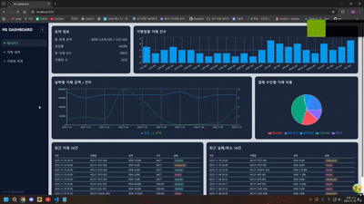
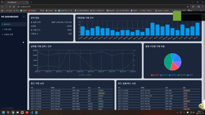
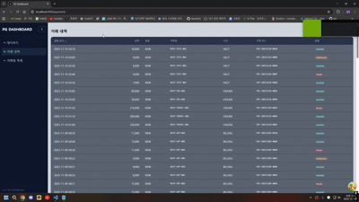
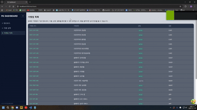
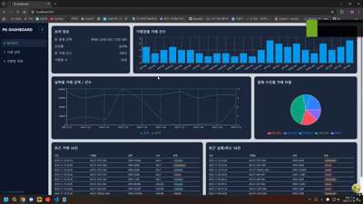

# PG 대시보드 (PG-DASHBOARD)
이 프로젝트는 ㈜올페이즈 [결제 서비스] 프론트엔드 개발자 채용 과제 전형을 위해 제작되었습니다.
제공된 채용 전용 API를 기반으로 결제/가맹점 관련 데이터를 시각화한 대시보드입니다.


## 설치 및 실행 방법
1. 패키지 설치
  - npm install

2. 실행
  - npm run dev

3. 접속
  - http://localhost:3000


## 대시보드 기능 요약
1. 첫 대시보드 화면
  - 총 거래 금액(KRW / USD) 요약 카드
  - 성공률 / 총 거래 건수 / 가맹점 수
  - 날짜별 거래 금액·건수 차트 (LineChart)
  - 결제 방식 비율 차트 (PieChart)
  - 가맹점별 거래량 차트 (BarChart)
  - 최근 거래 모니터링
  - 최근 실패/취소 거래 모니터링

2. 거래 내역 리스트 화면
  - 전체 결제 내역 테이블
  - 상태 배지 표시
  - SUCCESS / FAILED / CANCELLED
  - 금액 포맷팅(₩), 날짜 포맷팅(YYYY-MM-DD HH:mm)
  - 정렬 기능
  - 오름차순 / 내림차순 지원
  - 금액, 날짜, 상태 등 정렬

3. 가맹점 목록
  - 전체 가맹점 리스트 조회
  - 선택 시 해당 가맹점 상세 페이지 이동
  - 가맹점 기본 정보(코드, 이름, 상태, 업종) 표시

4. 가맹점 상세 정보
  - 기본 정보 카드
  - 사업자 정보 / 연락처 정보 카드
  - 등록일·최종 수정일 카드
  - 최근 거래 내역 테이블
  - 가맹점 목록으로 돌아가기 기능


## 디자인 의도 및 주요 UI/UX 포인트
대시보드는 오래 보는 환경을 고려해 눈의 피로를 줄일 수 있는 어두운 톤을 기본으로 사용했습니다.
그래프나 상태처럼 중요한 정보는 밝은 색으로 강조해 한눈에 구분할 수 있도록 했으며, 전체적으로 깔끔하고 부담 없는 UI를 목표로 구성했습니다.


## 환경 변수 및 API 사용 안내
본 프로젝트에서 사용하는 모든 API 응답은 JSON 형식이며, 상세한 API 스펙은 Swagger 문서에서 확인할 수 있습니다.
환경 변수를 이용해 Base URL을 관리하며,프로젝트 실행을 위해서는 루트 경로에 .env.local 파일이 필요합니다.

## .env.local 파일 예시
NEXT_PUBLIC_API_BASE_URL=EX_API_BASE_URL
정확한 API Base URL 및 Swagger문서는 과제 안내 문서 Notion을 참고해주세요.

프로젝트 내 API 호출은 위 환경 변수를 사용하여 이루어지며 .env.local 파일이 프로젝트 루트에 존재하지 않을 경우, API 요청이 실패하여 대시보드 기능이 정상적으로 동작하지 않습니다.


## 기술 스택
- Frontend Framework
  - Next.js 14.2.15 (App Router)
  - React 18.2.0

- Language
  - TypeScript 5.0.0

- Node.js
  - Node.js 20.15.0 (LTS)

- Styling
  - Tailwind CSS v4

- State Management
  - React Query v5 (@tanstack/react-query)
  - Recoil 0.7.7

- Charts
  - Recharts 3.4.1

- Icons
  - React Icons 5.5.0

- Linting / 개발 도구
  - ESLint 8.57.0 + eslint-config-next


## 프로젝트 폴더 구조 (실제 구조 기반)
```
project-root/
├── app/
│   ├── components/
│   │   ├── common/
│   │   │   ├── Cards.tsx
│   │   │   ├── Common.tsx
│   │   │   ├── CountChart.tsx
│   │   │   ├── DateChart.tsx
│   │   │   ├── PChart.tsx
│   │   │   ├── Tables.tsx
│   │   │   └── Utils.tsx
│   │   └── Sidebar.tsx
│   │
│   ├── merchants/
│   │   ├── [mchtCode]/
│   │   │   ├── Header.tsx
│   │   │   ├── Info.tsx
│   │   │   ├── page.tsx
│   │   │   └── Payments.tsx
│   │   ├── MchtTable.tsx
│   │   └── page.tsx
│   │
│   ├── payments/
│   │   ├── page.tsx
│   │   └── PaymentsT.tsx
│   │
│   ├── globals.css
│   ├── layout.tsx
│   └── page.tsx
│
├── config/
│   ├── QueryProvider.tsx
│   └── RecoilProvider.tsx
│
├── lib/
│   ├── types/
│   │   ├── common.ts
│   │   ├── merchant.ts
│   │   └── payment.ts
│   ├── api.ts
│   ├── queries.ts
│   └── QueryState.tsx
│
├── utils/
│   └── recoil/
│       └── atoms.ts
│
├── public/
│
├── .env.local
├── package.json
└── README.md
```

## 개선 방향
- 파이 차트의 포커스 효과를 완전히 제거하지 못해 일부 영역을 가리는 방식으로 처리한 점이 아쉽습니다.
- Recoil을 활용한 상태 관리가 충분히 구조적이거나 일관된 형태로 구성되지 않아 개선 여지가 있습니다.
- PG 대시보드로서 실제 관계자가 어떤 정보를 가장 효율적으로 확인할 수 있는지에 대한 UX 설계가 다소 부족하다고 느꼈습니다.
- CRUD 기능을 구현하지 않아, 데이터 조작 흐름을 시각적으로 보여주지 못한 점이 아쉽습니다.
- 차트가 많은 첫 대시보드 화면에서 사이드바 애니메이션이 느려지는 문제가 있었고, 최적화 실패로 인해 애니메이션을 제거한 점이 한계로 남았습니다.
- 색상 조합과 피로감을 줄이는 UI 디자인 부분에서 더 세심한 접근이 필요하다고 느꼈습니다.


# 실행 화면

## 1. 사이드바 

## 2. 차트 시각화

## 3. 거래 내역 정렬

## 4. 가맹점 목록

## 5. 로딩 구현 (에러와 빈 데이터 화면도 구현하였으나 화면에는 나오지 않음)

